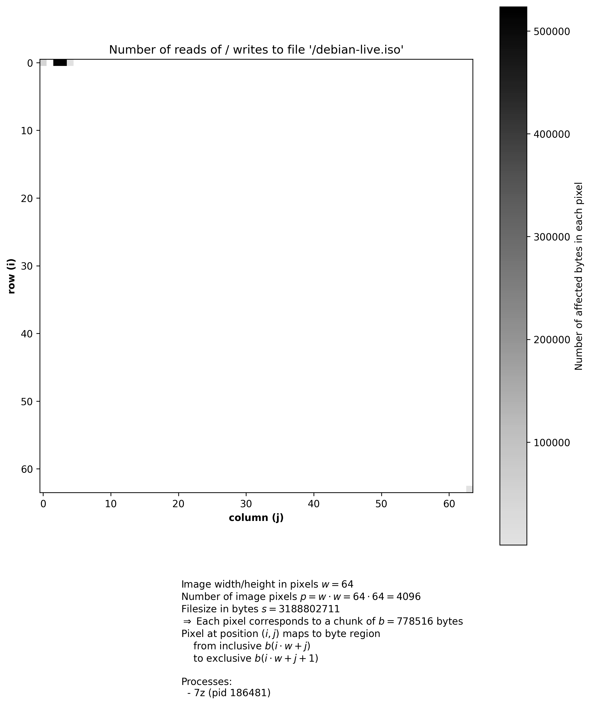

Visualize file reads and file writes.

> [!NOTE]
> Note that this is only a quick hobby project and not particularly (read: not at all) stable or safe.
> Use at your own risk and don't expect anything.

# What is this?

This is a fuse passthrough filesystem that monitors/logs read and write access to files.
Motivation is to analyze and visualize what parts of files are accessed by a program during its operation.

I got the idea after watching the talk https://media.ccc.de/v/38c3-fearsome-file-formats "Fearsome File Formats" by Ange Albertini about e.g. file polyglots.
This project can help visualize which bits and bytes are actually covered by parsers of various programs, which may help identify unexpected parts that do not actually affect the program execution.

The monitoring logic is adapted from the following projects:
- https://github.com/libfuse/python-fuse/blob/c4169e5e864bfb1eec342fe6dd0427959eeeaa38/example/xmp.py (GNU LGPLv2, Jeff Epler, Csaba Henk)
- https://github.com/rflament/loggedfs/blob/82aba9a93489797026ad1a37b637823ece4a7093/src/loggedfs.cpp (Apache 2.0, Remi Flament)

# Usage

Disclaimer: *Do not use this to mount over folders that contain data you care about. If I messed up the mapping this could potentially corrupt data.*

Clone this repo and install the project using your preferred package manager, e.g.:

```
git clone https://github.com/stfnw/fuse-monitor-read-write
cd fuse-monitor-read-write
python3 -m pipx install .
```

Then mount the filesystem over an existing directory you want to monitor:

```
fuse-monitor-read-write $DIR_TO_MONITOR
```

This will shadow that directory and for each original file `$FILE` the following additional files are generated:

  - `$FILE.csv`: A machine readable log of all reads and writes.

  - `$FILE-heatmap.pdf`: An aggregated heatmap of all accesses to the original file.

These files exist only in-memory for the duration the filesystem is mounted.
To preserve them permanently they can simply be copied out of the FUSE mountpoint.

Finally, the filesystem can be unmounted with:

```
fusermount3 -u $DIR_TO_MONITOR
```

# Demo

Here we show an example for file access made by `7z` when listing contents of the Debian Live ISO from https://www.debian.org/CD/live/:

```
python3 -m pipx install .
fuse-monitor-read-write ~/Downloads/demo/
mount | grep demo
ls ~/Downloads/demo/
7z l ~/Downloads/demo/debian-live.iso
cat ~/Downloads/demo/debian-live.iso.csv
cp -f ~/Downloads/demo/debian-live.iso-heatmap.png /tmp/
file /tmp/debian-live.iso-heatmap.png
```

*Note*: in newer versions PDF files are generated (not PNGs), which are vector graphics and also much smaller.

Terminal recording with asciinema:

[](https://asciinema.org/a/2cQm5BANJHEqREcmsPU0piWJl)

<!--
asciinema play -i 0.5 -s 2 demo/demo-iso-7z.cast
-->

Resulting heatmap:



As expected, accesses are concentrated in the beginning and end of the file.

The generated files can be found in
[demo/demo-iso-7z.cast](demo/demo-iso-7z.cast),
[demo/demo-iso-7z.csv](demo/demo-iso-7z.csv),
[demo/demo-iso-7z-heatmap.png](demo/demo-iso-7z-heatmap.png), and
[demo/demo-iso-7z-heatmap.pdf](demo/demo-iso-7z-heatmap.pdf).

The [demo folder](demo/) also contains results of other examples.
